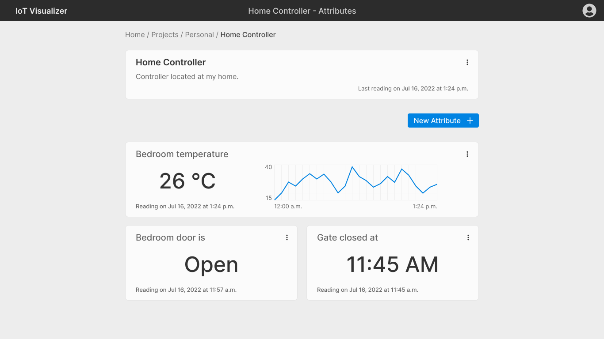

# IoT Visualizer

Visualize IoT device readings in a nice and well organized dashboard.



## Installation

Poetry is the package manager used in this project. In order to setup the inital configuration and download the dependencies run the following command:

```
poetry install
```

Then, to activate the virtual environment:

**Linux / MacOS**

```
source .venv/bin/activate
```

**Windows**

```
.venv/Scripts/activate.bat
```

## Execution

To run the project in development mode, run the following:

```
poetry run dev
```
